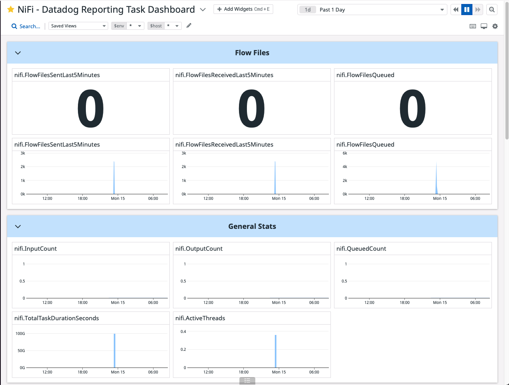

# NiFi-DataDogReportingTask
Monitor NiFi with the [Datadog Reporting Task 1.15.0](https://nifi.apache.org/docs/nifi-docs/components/org.apache.nifi/nifi-datadog-nar/1.15.0/org.apache.nifi.reporting.datadog.DataDogReportingTask/index.html)

## Quickstart with Docker Compose

For this example, we will use the following `docker-compose.yaml`

> File: `docker-compose.yaml`

```yaml
version: '3.3'

services:
  nifi:
    cap_add:
      - NET_ADMIN # low port bindings
    image: apache/nifi:latest
    container_name: nifi
    environment:
      - NIFI_WEB_HTTP_PORT=8080
      - NIFI_WEB_PROXY_HOST='192.168.86.234' # Your host IP
    ports:
      - "8080:8080/tcp" # HTTP interface
      - "8443:8443/tcp" # HTTPS interface
      - "514:514/tcp" # Syslog
      - "514:514/udp" # Syslog
      - "2055:2055/udp" # NetFlow
    volumes:
      - ./nifi_drivers:/opt/nifi/nifi-current/drivers
      - ./nifi_certs:/opt/certs
      - ./files:/opt/nifi/nifi-current/files
      # - ./nifi_flowfile:/opt/nifi/nifi-
      # - ./nifi-conf:/opt/nifi/nifi-current/conf
    restart: unless-stopped
```

```bash
$ docker-compose up -d
```

Open the local NiFi instance at [http://localhost:8080/nifi/](http://localhost:8080/nifi/)

## Configuring DataDogReportingTask

* Select the 3 line icon in the top right corner
* Choose `Controller Settings`, this should show the `NiFi Settings` set of tabs
* Choose the `Reporting Task` tab and click + to add a Reporting Task
* A pop up window `Add Reporting Task` should allow you to find `DataDogReportingTask` 
* Click `ADD`, this will close the pop up screen
* Back in the NiFi Settings right area, click on the DataDogReportingTask edit pencil
* In the pop up window `Configure Reporting Task` `PROPERTIES`, configure the environment and insert the [Datadog API Key](https://docs.datadoghq.com/account_management/api-app-keys/#api-keys)

| PropertyValue                        |    Setting   |
|--------------------------------------|--------------|
| Metrics prefix                       | nifi         |
| Environment                          | dev          |
| API key                              | DD-API-KEY   |
| Datadog transport                    | Datadog HTTP |

* In the `SETTINGS` tab of the `Configure Reporting Task` screen, configure the `Run Schedule` option (in `sec` or `minutes`), depending on your need and use case
* Click the play button to start the task
* Import the NiFi Datadog Dashboard to preview the metrics

## Datadog NiFi Dashboard

[NiFi - Datadog Reporting Task Dashboard](NiFi-DatadogReportingTaskDashboard.json)


## Generate Load with Sample Flows

Use a template from [HortonWorks Gallery](https://github.com/hortonworks-gallery/nifi-templates) to generate flows.

## (31) Metrics 

| NiFi Metric                          | Type  | Default Tags | Custom Metric |
|--------------------------------------|-------|--------------|---------------|
| nifi.InputBytes                      | Gauge | host         | TRUE          |
| nifi.InputCount                      | Gauge | host         | TRUE          |
| nifi.jvm.uptime                      | Gauge | host         | TRUE          |
| nifi.BytesQueued                     | Gauge | host         | TRUE          |
| nifi.OutputBytes                     | Gauge | host         | TRUE          |
| nifi.OutputCount                     | Gauge | host         | TRUE          |
| nifi.QueuedBytes                     | Gauge | host         | TRUE          |
| nifi.QueuedCount                     | Gauge | host         | TRUE          |
| nifi.ActiveThreads                   | Gauge | host         | TRUE          |
| nifi.jvm.heap_used                   | Gauge | host         | TRUE          |
| nifi.jvm.heap_usage                  | Gauge | host         | TRUE          |
| nifi.FlowFilesQueued                 | Gauge | host         | TRUE          |
| nifi.jvm.thread_count                | Gauge | host         | TRUE          |
| nifi.jvm.non_heap_usage              | Gauge | host         | TRUE          |
| nifi.BytesReadLast5Minutes           | Gauge | host         | TRUE          |
| nifi.BytesSentLast5Minutes           | Gauge | host         | TRUE          |
| nifi.jvm.daemon_thread_count         | Gauge | host         | TRUE          |
| nifi.jvm.gc.runs.PS_Scavenge         | Gauge | host         | TRUE          |
| nifi.jvm.gc.time.PS_Scavenge         | Gauge | host         | TRUE          |
| nifi.BytesWrittenLast5Minutes        | Gauge | host         | TRUE          |
| nifi.TotalTaskDurationSeconds        | Gauge | host         | TRUE          |
| nifi.jvm.gc.runs.PS_MarkSweep        | Gauge | host         | TRUE          |
| nifi.jvm.gc.time.PS_MarkSweep        | Gauge | host         | TRUE          |
| nifi.BytesReceivedLast5Minutes       | Gauge | host         | TRUE          |
| nifi.FlowFilesSentLast5Minutes       | Gauge | host         | TRUE          |
| nifi.jvm.file_descriptor_usage       | Gauge | host         | TRUE          |
| nifi.jvm.thread_states.blocked       | Gauge | host         | TRUE          |
| nifi.jvm.thread_states.runnable      | Gauge | host         | TRUE          |
| nifi.jvm.thread_states.terminated    | Gauge | host         | TRUE          |
| nifi.FlowFilesReceivedLast5Minutes   | Gauge | host         | TRUE          |
| nifi.jvm.thread_states.timed_waiting | Gauge | host         | TRUE          |

Current limitations: The task does not successfully pass the metadata to Datadog. At the moment only the host shows up in the Datadog metric.


Sources:
[NiFi Documentation](https://nifi.apache.org/docs/nifi-docs/)
[DataDogReportingTask Source Code](https://github.com/apache/nifi/blob/66e2741871e4de25631ffe32b961a622ca5e3ceb/nifi-nar-bundles/nifi-datadog-bundle/nifi-datadog-reporting-task/src/main/java/org/apache/nifi/reporting/datadog/DataDogReportingTask.java)
[NiFi.rocks - Monitoring with Data Dog](https://www.nifi.rocks/monitoring-with-data-dog/)
[Syncfusion - Data Integration](https://help.syncfusion.com/data-integration/reportingtasks/datadogreportingtask)
